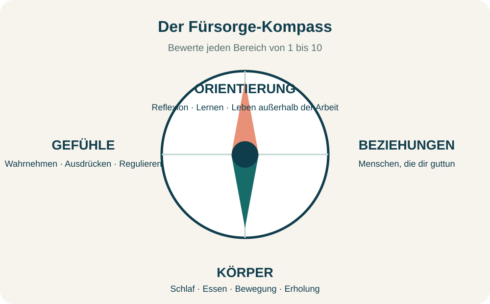
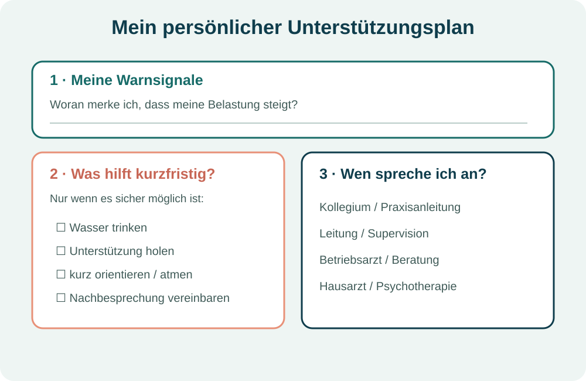

# Psychische Gesundheit im Pflegeberuf stärken: 8 praxistaugliche Schritte

Pflege ist Beziehungsarbeit. Du begleitest Menschen in verletzlichen Lebenssituationen, trägst Verantwortung und musst häufig unter Zeitdruck handeln. Das kann sinnvoll und erfüllend sein – und gleichzeitig körperlich und psychisch fordern.

Psychische Gesundheit im Pflegeberuf zu stärken bedeutet deshalb nicht, einfach „noch belastbarer“ zu werden. Es bedeutet, Warnsignale wahrzunehmen, die eigenen Grenzen ernst zu nehmen, Unterstützung zu organisieren und gemeinsam auf bessere Arbeitsbedingungen hinzuwirken. Die folgenden Schritte sind als Reflexions- und Alltagshilfe gedacht. Sie ersetzen keine ärztliche, psychotherapeutische oder psychosoziale Beratung.

> **E-Book als PDF:** [Die vollständige Handreichung herunterladen](./psychische-gesundheit-im-pflegeberuf.pdf)
>
> **Key Takeaways**
> - Selbstfürsorge ist ein wichtiger Baustein, kann aber Personalmangel, schlechte Dienstplanung oder fehlende Pausen nicht ausgleichen.
> - Kleine, konkrete Schritte helfen eher als ein umfassendes Programm, das im Schichtalltag nicht umsetzbar ist.
> - Überforderung früh anzusprechen ist kein Versagen, sondern dient der eigenen Gesundheit und der sicheren Versorgung.
> - Bei anhaltenden Beschwerden oder einer akuten Krise ist professionelle Hilfe wichtig.

## 1. Eigene Belastungszeichen früh erkennen

Der erste Schritt ist nicht, jede Belastung sofort zu lösen. Entscheidend ist zunächst, Veränderungen bei dir wahrzunehmen. Warnsignale können körperlich, emotional, gedanklich oder im Verhalten auftreten.

Mögliche Hinweise sind zum Beispiel:

- anhaltende Erschöpfung oder Schlafprobleme,
- innere Unruhe, Gereiztheit oder ungewöhnliche Niedergeschlagenheit,
- wiederkehrendes Grübeln über Situationen aus dem Dienst,
- Konzentrationsprobleme oder das Gefühl, ständig „auf Empfang“ zu sein,
- Rückzug von Menschen, die dir normalerweise guttun,
- körperliche Beschwerden, die sich in belastenden Phasen verstärken.

Ein einzelnes Signal sagt noch nicht, was dahintersteckt. Es kann aber ein Anlass sein, genauer hinzuschauen. Frage dich: **Was hat sich in den vergangenen Wochen verändert? Was brauche ich, um sicher weiterarbeiten zu können?**

Wenn Beschwerden anhalten, stärker werden oder deinen Alltag deutlich beeinträchtigen, solltest du Unterstützung holen – etwa in der Hausarztpraxis, bei einer psychotherapeutischen Praxis, beim betriebsärztlichen Dienst oder einer geeigneten Beratungsstelle.

## 2. Mit dem Fürsorge-Kompass den nächsten kleinen Schritt wählen

Selbstfürsorge wird oft zu groß gedacht. Der Fürsorge-Kompass macht daraus eine kurze Standortbestimmung. Bewerte die vier Bereiche für dich auf einer Skala von 1 bis 10:

1. **Körper:** Schlaf, Essen, Bewegung und Erholung
2. **Gefühle:** Gefühle wahrnehmen, ausdrücken und regulieren
3. **Beziehungen:** Kontakt zu Menschen, die dir guttun
4. **Orientierung:** Reflexion, Lernen und Dinge außerhalb der Arbeit

Der niedrigste Wert ist nicht automatisch ein persönliches Versagen. Er zeigt zunächst, wo gerade der größte Unterstützungsbedarf liegen könnte. Wähle danach **eine** realistische Veränderung für die nächsten sieben Tage: einen Anruf, eine feste Erholungszeit, ein Gespräch im Team oder einen Termin bei einer Fachperson.

> **Praxisimpuls:** Formuliere den Schritt so, dass du später prüfen kannst, ob er stattgefunden hat. „Mehr auf mich achten“ ist schwer überprüfbar. „Am Mittwoch nach dem Dienst zehn Minuten mit meiner Vertrauensperson telefonieren“ ist konkreter.

## 3. Professionelle Grenzen setzen, ohne unnahbar zu werden

Professionelle Distanz bedeutet nicht Kälte. Sie bedeutet, zugewandt zu arbeiten und zugleich die eigene berufliche Rolle, die eigenen Grenzen und die eigenen Ressourcen zu schützen.

Hilfreiche Fragen sind:

- Was gehört zu meiner beruflichen Verantwortung – und was nicht?
- Welche Gefühle nehme ich nach Dienstschluss mit nach Hause?
- Mit wem kann ich eine belastende Situation besprechen?
- Welche Grenze möchte ich in einer ähnlichen Situation künftig klarer benennen?

Ein Feierabendritual kann beim Übergang helfen: Arbeitskleidung bewusst ablegen, einen kurzen Weg zu Fuß gehen, Musik hören oder einige Minuten ruhig sitzen. Es gibt nicht das eine richtige Ritual. Es muss zu deinem Alltag passen und darf klein sein.

Ebenso wichtig ist der innere Dialog. Nach schwierigen Situationen denken viele Menschen: „Ich hätte besser reagieren müssen“ oder „Ich bin nicht gut genug“. Selbstreflexion kann Lernen ermöglichen; dauernde Selbstabwertung hilft dagegen selten.

**Übung:** Schreibe einen selbstkritischen Satz auf. Frage dich anschließend: *Was würde ich einer Kollegin oder einem Kollegen in derselben Situation sagen?* Formuliere daraus einen realistischen, freundlichen Satz: „Die Situation war schwierig. Ich prüfe, was ich daraus lernen kann, und hole mir Unterstützung, wenn ich sie brauche.“

## 4. Schwierige Gespräche klar und wertschätzend führen

Klare Kommunikation löst nicht jeden Konflikt. Sie kann aber Missverständnisse verringern, Prioritäten sichtbar machen und Zusammenarbeit erleichtern. Vier Grundhaltungen sind besonders hilfreich:

- **Zuhören:** aufmerksam sein und nachfragen,
- **wertschätzen:** die Perspektive des Gegenübers ernst nehmen,
- **klar sprechen:** Informationen strukturieren und Fachbegriffe erklären,
- **Grenzen benennen:** ruhig und eindeutig sagen, was möglich ist und was nicht.

Eine Ich-Botschaft kann helfen, die eigene Wahrnehmung anzusprechen, ohne das Gegenüber pauschal zu beschuldigen:

> **Ich fühle mich …, wenn …, weil … Ich wünsche mir …**

Beispiel: „Ich fühle mich überfordert, wenn ich mehrere zeitkritische Aufgaben gleichzeitig allein übernehmen soll, weil ich dann nicht allen Anforderungen sicher gerecht werden kann. Ich wünsche mir, dass wir die Aufgaben kurz priorisieren und verteilen.“

Bei Gefahr, Aggression oder akuter Überforderung gilt: **Sicherheit zuerst.** Hole Unterstützung und beachte die Regeln deiner Einrichtung. Ein Gespräch muss nicht allein zu Ende geführt werden, wenn die Situation unsicher wird.

## 5. Belastungen nicht individualisieren: Arbeitsbedingungen zählen

Zeitdruck, Personalmangel, Schichtdienst, Unterbrechungen, körperliche Belastung, Konflikte und unklare Zuständigkeiten können psychisch belasten. Auch hohe eigene Ansprüche oder fehlende Abgrenzung können eine Rolle spielen. Nicht alles davon lässt sich persönlich verändern.

Die WHO nennt unter anderem hohe Arbeitsmengen, Unterbesetzung, lange oder unplanbare Arbeitszeiten, geringe Einflussmöglichkeiten, fehlende Unterstützung, unklare Rollen sowie Gewalt und Belästigung als psychosoziale Risiken am Arbeitsplatz. Gesundheits- und Notfallberufe können durch die Art ihrer Tätigkeit außerdem häufiger belastenden Ereignissen ausgesetzt sein. ([WHO, Mental health at work, 2026](https://www.who.int/news-room/fact-sheets/detail/mental-health-at-work))

Auch die BAuA betont, dass psychische Belastungen nicht nur auf individueller Ebene bearbeitet werden sollten. Zu einer menschengerechten Arbeitsgestaltung gehören unter anderem ein angemessenes Verhältnis von Arbeitsmenge und Arbeitszeit, klare Zuständigkeiten, ausreichende Pausen und Ruhezeiten, soziale Unterstützung sowie Schutz vor Gewalt. ([BAuA, Psychische Faktoren](https://www.baua.de/DE/Themen/Arbeitsgestaltung/Gefaehrdungsbeurteilung/Handbuch-Gefaehrdungsbeurteilung/Expertenwissen/Psychische-Faktoren))

Das bedeutet praktisch: Wenn Pausen regelmäßig ausfallen, Prioritäten dauerhaft unklar sind oder belastende Ereignisse nicht nachbesprochen werden können, ist das nicht nur ein individuelles Selbstfürsorgeproblem. Es gehört in die Gespräche mit Team, Leitung, Interessenvertretung, Betriebsarzt oder Arbeitsschutz.

| Frage | Möglicher nächster Schritt |
|---|---|
| Was kann ich selbst beeinflussen? | Eine Priorität klären, eine Pause anmelden, eine Grenze formulieren |
| Wen muss ich einbeziehen? | Kollegium, Praxisanleitung, Leitung, Supervision oder Betriebsarzt |
| Was braucht eine strukturelle Lösung? | Dienstplanung, Personalausstattung, Zuständigkeiten, Schutzkonzept oder Nachbesprechung |

## 6. Pausen und sichere Unterbrechungen ernst nehmen

Pausen unterstützen Erholung und Konzentration. Sie sind aber nur möglich, wenn die Versorgung und die Sicherheit der Patientinnen und Patienten gewährleistet sind und die Organisation sie tatsächlich ermöglicht.

Je nach Situation können hilfreich sein:

- eine kurze bewusste Atem- oder Bewegungsunterbrechung,
- einige Minuten außerhalb des unmittelbaren Arbeitsbereichs,
- eine reguläre Pause, die wirklich der Erholung dient,
- eine kurze Nachbesprechung nach einem belastenden Ereignis.

Eine Pause allein kann schlechte Arbeitsbedingungen nicht ausgleichen. Wenn Pausen regelmäßig ausfallen, sollte das als Team- und Organisationsthema dokumentiert und angesprochen werden. Die BAuA beschreibt ausreichende Pausen-, Ruhe- und Erholungszeiten als Teil guter Arbeitsgestaltung – nicht als Luxus.

## 7. Bei akuter Überforderung zuerst Sicherheit herstellen

Wenn dein Herz rast, du zitterst oder dir plötzlich alles zu viel wird, prüfe zuerst: **Bin ich gerade sicher? Kann die Versorgung kurz übergeben werden? Wen kann ich holen?** Erst wenn die Situation sicher ist, können kurze Orientierungsübungen sinnvoll sein.

Mögliche kleine Schritte sind:

1. langsam ausatmen, ohne den Atem anzuhalten,
2. beide Füße auf dem Boden spüren,
3. fünf Dinge im Raum benennen,
4. einen Schluck Wasser trinken,
5. kurz den Raum wechseln, sofern das möglich und sicher ist,
6. eine Kollegin, einen Kollegen oder eine Führungskraft ansprechen.

Eine Atemübung sollte niemals zum Leistungsdruck werden. Atme ruhig ein und etwas länger aus. Wenn Schwindel, Unwohlsein oder mehr Angst entsteht, brich ab und atme normal. Auch die 5-4-3-2-1-Orientierung ist optional und nicht für jede Person passend.

Diese Schritte sind keine Behandlung. Sie können helfen, den nächsten sicheren Moment zu erreichen. Bei anhaltenden oder starken Beschwerden ist fachliche Unterstützung wichtig.

## 8. Einen persönlichen Unterstützungsplan erstellen

In einer Krise ist es schwer, zum ersten Mal zu überlegen, wen man ansprechen könnte. Ein kurzer Unterstützungsplan schafft Orientierung, bevor die Belastung ihren Höhepunkt erreicht.

Notiere für dich:

- **Meine Warnsignale:** Woran merke ich, dass meine Belastung steigt?
- **Was hilft kurzfristig, wenn es sicher möglich ist?** Nenne drei konkrete Dinge.
- **Wen kann ich ansprechen?** Kollegium, Praxisanleitung, Leitung, Supervision, Betriebsarzt, Beratungsstelle, Hausarztpraxis oder Psychotherapie.
- **Was soll eine Vertrauensperson wissen?** Zum Beispiel: „Wenn ich mich zurückziehe und nicht mehr priorisieren kann, sprich mich bitte an.“

Der Plan darf sich verändern. Prüfe ihn nach einigen Wochen oder nach einer besonders belastenden Situation. Unterstützung anzunehmen ist kein Versagen, sondern ein verantwortungsvoller Umgang mit der eigenen Gesundheit.

## Wann professionelle Hilfe wichtig ist

Wende dich an eine geeignete Fachperson, wenn Beschwerden anhalten, zunehmen oder deinen Schlaf, Alltag und deine Arbeit deutlich beeinträchtigen. Erste Anlaufstellen können die Hausarztpraxis, eine psychotherapeutische Praxis, der betriebsärztliche Dienst, eine Beratungsstelle oder ein Krisendienst sein. Das Bundesgesundheitsportal verweist außerhalb der Öffnungszeiten außerdem auf den ärztlichen Bereitschaftsdienst unter **116 117**. ([gesund.bund.de, Psychische Krisen](https://gesund.bund.de/wege-im-gesundheitswesen/erwachsenenleben/notfaelle/psychische-krisen))

Die TelefonSeelsorge ist anonym, kostenfrei und rund um die Uhr erreichbar unter **0800 1110111**, **0800 1110222** oder **116 123**. ([TelefonSeelsorge Deutschland](https://www.telefonseelsorge.de/telefon/))

Wenn du dich oder andere unmittelbar gefährdet siehst, rufe **112** oder wende dich an die nächste Notaufnahme. In einer akuten Gefahrensituation solltest du nicht allein bleiben.

## Häufige Fragen zur psychischen Gesundheit im Pflegeberuf

### Was gehört zur Selbstfürsorge in der Pflege?

Selbstfürsorge umfasst den bewussten Umgang mit körperlichem, psychischem und sozialem Wohlbefinden. Dazu gehören beispielsweise Schlaf, Erholung, Bewegung, Austausch, Reflexion, das Wahrnehmen von Grenzen und die Nutzung von Unterstützung. Sie ist ein Teil des Gesundheitsschutzes, aber kein Ersatz für gute Arbeitsbedingungen.

### Wie kann ich mich nach belastenden Diensten besser abgrenzen?

Ein verlässliches Übergangsritual kann helfen: Arbeitskleidung bewusst wechseln, einen kurzen Spaziergang machen, Musik hören, duschen oder mit einer Vertrauensperson sprechen. Wichtig ist nicht die Methode, sondern dass sie den Übergang zwischen Dienst und Privatleben markiert.

### Was kann ich tun, wenn Pausen regelmäßig ausfallen?

Sprich das möglichst konkret an: Wann sind Pausen ausgefallen, welche Auswirkungen hatte das und welche Lösung wäre realistisch? Beziehe Team, Leitung, Interessenvertretung, Betriebsarzt oder Arbeitsschutz ein. Regelmäßig ausfallende Pausen sind ein Organisations- und nicht nur ein persönliches Problem.

### Wie spreche ich Überforderung im Team an?

Beschreibe die Situation konkret und formuliere eine Bitte. Zum Beispiel: „Ich fühle mich überfordert, wenn mehrere zeitkritische Aufgaben gleichzeitig bei mir liegen. Können wir kurz priorisieren und verteilen?“

### Wann sollte ich professionelle Hilfe suchen?

Wenn Beschwerden anhalten, stärker werden oder deinen Alltag und deine Arbeitsfähigkeit beeinträchtigen, ist professionelle Hilfe sinnvoll. Du musst nicht warten, bis du „gar nicht mehr kannst“.

## Fazit: Ein kleiner Schritt ist ein Anfang

Psychische Gesundheit im Pflegeberuf zu stärken ist kein persönliches Leistungsprojekt. Pflege braucht Menschen, die sich umeinander kümmern – und Arbeitsbedingungen, die das ermöglichen.

Wähle heute nur einen Schritt: Bewerte deinen Fürsorge-Kompass, notiere ein Warnsignal, sprich eine Priorität an oder trage eine Ansprechperson in deinen Unterstützungsplan ein. Wenn Belastungen bleiben, hole dir Hilfe. Das ist kein Versagen, sondern professionelle Verantwortung.

> **Hinweis:** Dieser Artikel ist Bildungs- und Reflexionsmaterial. Er ersetzt keine ärztliche, psychotherapeutische oder psychosoziale Beratung und keine Behandlung. Die Übungen sind optional und sollten abgebrochen werden, wenn sie Beschwerden verstärken.

## Quellen und weiterführende Informationen

- Mayer, Barbara Magdalena (2026): *Die eigene psychische Gesundheit im Pflegeberuf stärken. Eine praxisnahe Handreichung zur Selbstreflexion.* Bereitgestellte Handreichung.
- Bundesanstalt für Arbeitsschutz und Arbeitsmedizin (BAuA): [Psychische Faktoren](https://www.baua.de/DE/Themen/Arbeitsgestaltung/Gefaehrdungsbeurteilung/Handbuch-Gefaehrdungsbeurteilung/Expertenwissen/Psychische-Faktoren), abgerufen am 08.10.2026.
- World Health Organization (WHO): [Mental health at work](https://www.who.int/news-room/fact-sheets/detail/mental-health-at-work), 15.09.2026.
- gesund.bund.de: [Anlaufstellen bei psychischen Krisen](https://gesund.bund.de/wege-im-gesundheitswesen/erwachsenenleben/notfaelle/psychische-krisen), Stand 23.04.2026.
- TelefonSeelsorge Deutschland: [Telefonische Beratung](https://www.telefonseelsorge.de/telefon/), abgerufen am 08.10.2026.

<!-- [INTERNAL-LINK] Ergänze hier bei Veröffentlichung einen Link zur vollständigen Handreichung. -->
<!-- [INTERNAL-LINK] Ergänze hier einen Link zu einer Seite über Supervision, Arbeitsschutz oder betriebliche Gesundheitsförderung. -->
